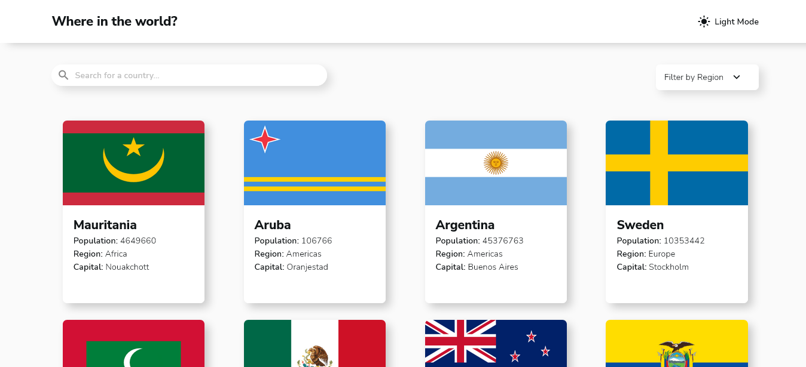
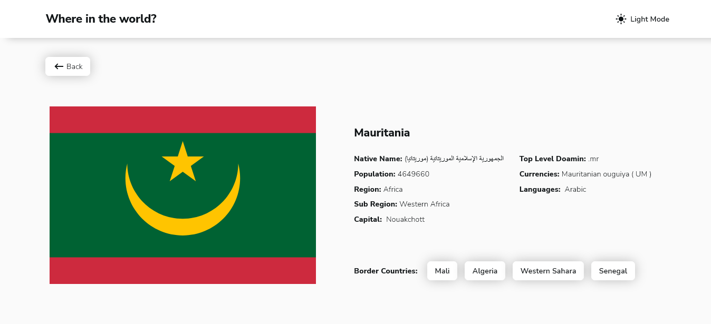

# Frontend Mentor - REST Countries API with color theme switcher solution

This is a solution to the [REST Countries API with color theme switcher challenge on Frontend Mentor](https://www.frontendmentor.io/challenges/rest-countries-api-with-color-theme-switcher-5cacc469fec04111f7b848ca). Frontend Mentor challenges help you improve your coding skills by building realistic projects.

## Table of contents

- [Overview](#overview)
  - [The challenge](#the-challenge)
  - [Screenshot](#screenshot)
  - [Links](#links)
- [My process](#my-process)
  - [Built with](#built-with)
  - [What I learned](#what-i-learned)
  - [Continued development](#continued-development)
  - [Useful resources](#useful-resources)

## Overview

### The challenge

Users should be able to:

- See all countries from the API on the homepage
- Search for a country using an `input` field
- Filter countries by region
- Click on a country to see more detailed information on a separate page
- Click through to the border countries on the detail page
- Toggle the color scheme between light and dark mode _(optional)_

### Screenshot

### `Home` Page Preview



### `Details` Page Preview



### Links

- Solution URL: [FrontendMentor](https://www.frontendmentor.io/solutions/rest-countries-api-with-color-theme-switcher-OG64K6ZrGb)
- Live Site URL: [where-in-the-world?](https://where-in-the-world-taupe.vercel.app/)

## My process

### Built with

- Semantic HTML5 markup
- CSS custom properties
- Flexbox
- CSS Grid
- Mobile-first workflow
- [React](https://reactjs.org/) - JS library
- [SCSS](https://sass-lang.com/) - For styles
- [Vite](https://vitejs.dev/) - For development environment

### What I learned

I learned to fetch data using `useeffect` hook while calling asynchronous function.

```jsx
useEffect(() => {
  const baseUrl = 'https://restcountries.com/';
  const version = 'v3.1';
  const getData = async function getCountriesInfo() {
    const response = await fetch(`${baseUrl}${version}/${searchType}`);
    // If response.ok is true status='OK' and retrive response.json() and set it to countriesinfo
    if (response.ok) {
      setStatus(response.statusText);
      const data = await response.json();
      if (searchType.includes('alpha?codes=')) {
        setBorderingCountries(data);
      } else {
        SetCountriesInfo(data);
      }
    }
    // else set status ='Not Found' and reject response
    else {
      setStatus(response.statusText);
      const rejected = Promise.reject(response);
      rejected.catch((error) => error);
    }
  };
  // Function launches after 0.1 seconds (100 ms) of the last keystroke
  // On first render you don't want to launch anything
  // Thus, you check if the user typed a query at first
  let apiCallTimer = setTimeout(() => {
    if (searchType) getData();
  }, 100);
  // If useEffect() relaunches, you clear the function
  // That means, the previous function won't launch
  // Thus, won't send a request to the API
  return () => clearTimeout(apiCallTimer);
}, [searchType]);
```

I learned how to use `Routes` and `Route` to different components and call `Route` through `Link`.
Learned `useLocation hook`. `This hook returns the current location object. This can be useful if you'd like to perform some side effect whenever the current location changes.`

```jsx
/* --------------------------App.jsx-------------------------- */
<Routes>
  <Route
    path="/"
    element={...}
  ></Route>
  <Route
    path="/CountryDetails"    element={...}
  ></Route>
</Routes>

/* -------------------BorderingCountry.jsx------------------- */
<Link
  to="/CountryDetails"
  state={countryDetailsObj}
  className="bordering-country"
>
  {props.name.common}
</Link>
```

And finally I learned to use `useContext` hook to pass props to grandchildren or further down the road.

```jsx
/* In top level component where you want to pass props through */
/* --------------------------App.jsx-------------------------- */
export const searchTypeContext = createContext();

export default function App(){
  const [searchType, setSearchType] = useState('all');
  // Passing setSearchType as value
<searchTypeContext.Provider value={setSearchType}>
{...children}
</searchTypeContext.Provider>
}

/* In child component where you want to pass props through */
/* ------------------CountryDetails.jsx------------------ */
import { searchTypeContext } from '../App';
...
 setSearchType(`alpha?codes=${countryCodes}`);
...

```

### Continued development

I want to focus on how to use React hooks more efficienty. In this project I struggled how to divide certain part of components to simple resuable component, I want to get a work around it.

### Useful resources

- [Learn React for Free in Scrimba](https://scrimba.com/learn/learnreact) - This helped me for learning React. I really liked this pattern and will use it going forward.
- [React Router](https://www.youtube.com/watch?v=Ul3y1LXxzdU) - This is an amazing youtube video explaning different react router library.
